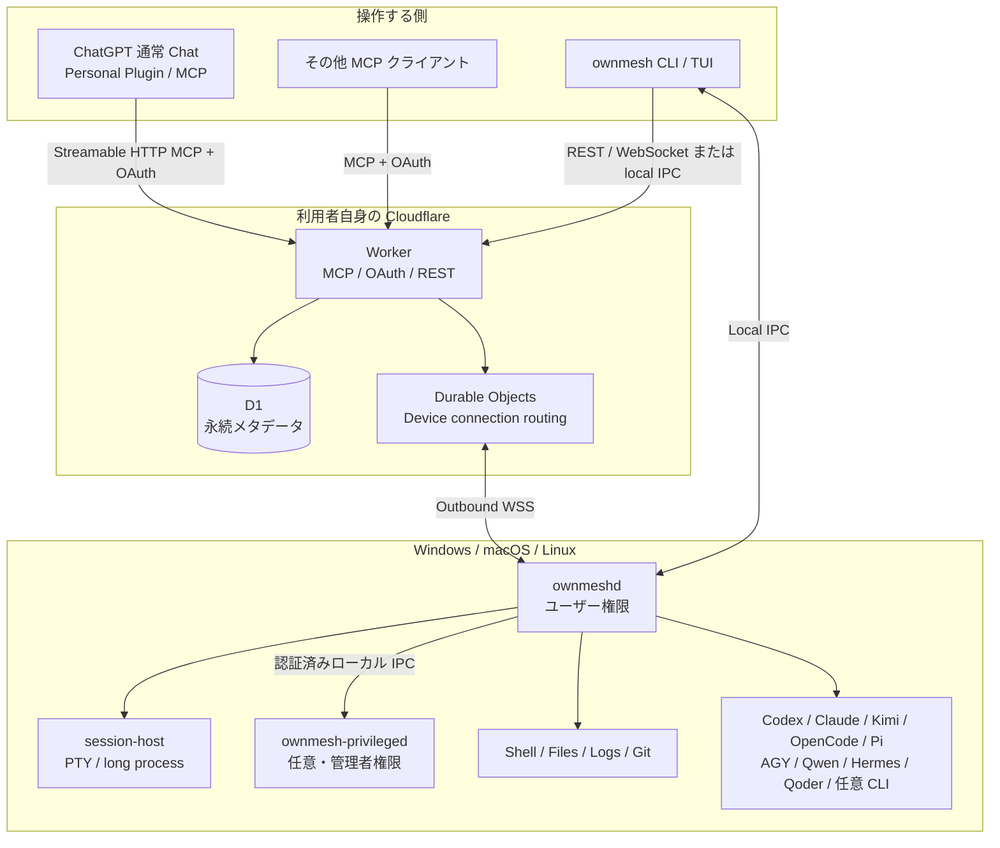
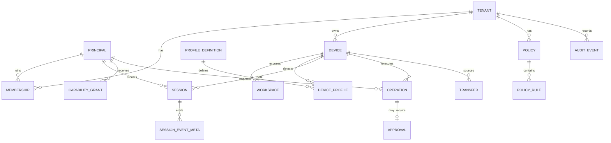

# OwnMesh 総合仕様書

**文書版:** 0.1.0-draft  
**対象リリース:** OwnMesh 1.0  
**作成日:** 2026-08-06  
**ライセンス方針:** Apache License 2.0  
**文書の状態:** 実装開始に使用できる設計基準。実装中の変更は ADR と本書の改訂で管理する。

---

## 0. 文書の目的

本書は、OwnMesh を実装し、OSS として公開・保守するための製品仕様、システム設計、セキュリティ境界、CLI/TUI、MCP、Cloudflare コントロールプレーン、OS エージェント、CLI プロファイル、テスト、リリース要件を一つにまとめた基準文書である。

OwnMesh は、ChatGPT を含む任意の MCP クライアント、人間が使う OwnMesh CLI/TUI、別の PC から、Windows・macOS・Linux 上のコマンド、ファイル、ログ、プロセス、対話セッション、コーディング CLI を安全に利用するための OSS 実行基盤である。

OwnMesh は AI オーケストレーターではない。ChatGPT、Codex CLI、Claude Code、Kimi Code、OpenCode、Pi Coding Agent、Antigravity CLI、Qwen Code、Hermes Agent、Qoder CLI の上下関係や役割を固定しない。OwnMesh が提供するのは、AI と人間が自由に組み合わせて使える能力、接続、認証、権限、セッション、監査である。

### 0.1 規範語

本書では次の語を規範的に使用する。

- **MUST / 必須:** 実装が満たさなければ OwnMesh 1.0 準拠とはみなさない。
- **SHOULD / 推奨:** 強い理由がない限り満たす。
- **MAY / 任意:** 実装または利用者が選択できる。

### 0.2 正本

- 実装上の識別子、API 名、設定キー、エラーコードは英語を正本とする。
- 本書の日本語記述は設計意図の正本とする。
- 将来英語版を公開する場合、意味が衝突した箇所は ADR で解決する。

---

# 1. 製品定義

## 1.1 一文での定義

> **自分の Cloudflare にデプロイし、ChatGPT や任意の MCP クライアント、人間の CLI から、自分の Windows・macOS・Linux と、その上の任意 CLI を安全に操作できる OSS 実行基盤。**

## 1.2 タグライン

> **Any AI. Any CLI. Any machine. Your cloud.**

## 1.3 中核思想

1. **能力を提供し、役割を固定しない。**  
   ChatGPT をオーケストレーター、Codex や Claude Code を worker とする隠しプロンプトや強制ワークフローを持たない。

2. **ユーザーが所有する。**  
   コントロールプレーンは利用者自身の Cloudflare アカウントへデプロイする。OwnMesh プロジェクト運営者の中央サービスを必須にしない。

3. **ローカルファースト。**  
   ソースコード、完全ログ、CLI 認証情報、セッション本体、ファイル本体は標準で PC に置く。

4. **Full Access を正式機能として提供する。**  
   ユーザーが選択した場合、ユーザー権限および管理者/root 権限を含む操作を実行できる。OwnMesh は隠れた禁止リストでその意思を上書きしない。

5. **Full Access と堅牢性を両立する。**  
   強いセキュリティとは「できることを減らす」ことではなく、正しい主体、正しい端末、正しい権限、改ざん防止、再実行防止、監査可能性を保証することである。

6. **人間には簡単で、機械には明確。**  
   人間向けにはリッチで分かりやすい TUI、スクリプトや AI 向けには安定した CLI/JSON/MCP を提供する。

7. **クラウドファイル中継は標準オフ。**  
   R2、TURN、S3 等の中継は自動有効化しない。必要な利用者だけが明示的に追加する。

8. **テレメトリは標準オフ。**  
   OwnMesh プロジェクト運営者へ利用状況、コマンド、ログ、クラッシュ情報を自動送信しない。

9. **個人利用からチーム・組織へ拡張できる。**  
   初期 UX は個人一人向けに簡単にするが、内部モデルは Tenant、Principal、Membership、Capability Grant を最初から持つ。

10. **コードを読みやすく保つ。**  
    UI、ドメイン、プロトコル、OS 固有処理、特権処理、外部アダプターを分離し、巨大な条件分岐や暗黙状態を避ける。

## 1.4 対象利用者

### 初期の主対象

- 個人一人が複数 PC を所有している。
- ChatGPT の通常 Chat から PC を利用したい。
- 別 PC の OwnMesh CLI/TUI から操作したい。
- コーディング CLI を既に各 PC で利用している。
- 自分の Cloudflare アカウントへ OSS をデプロイできる。

### 拡張対象

- 家族、少人数チーム。
- 組織、複数ユーザー、複数管理者。
- CI、サービスアカウント、自動化クライアント。
- ChatGPT 以外の MCP クライアント。
- Cloudflare 以外の互換コントロールプレーン実装。

## 1.5 非目標

OwnMesh 1.0 は次を目的としない。

- 独自 LLM、独自コーディングエージェントの開発。
- AI のタスク分解、担当者選択、上下関係の固定。
- ChatGPT 会話履歴の完全ミラーリング。
- Codex と Claude Code の意味的コンテキストを自動で同一化すること。
- OwnMesh 運営者が管理する中央 SaaS を必須にすること。
- 標準でのクラウドファイル保管。
- 初期リリースにおける Web 管理画面。
- 任意プロセスの外向き通信を全 OS で完全にドメイン単位制御すること。
- AI のリスク判断をセキュリティ境界として信用すること。

---

# 2. 用語

| 用語 | 意味 |
|---|---|
| Control Plane | 利用者自身の Cloudflare 上で動く OwnMesh サーバー群 |
| Agent | PC 上でユーザー権限で常駐する `ownmeshd` |
| Privileged Broker | 管理者/root 操作だけを受け持つ `ownmesh-privileged` |
| Session Host | PTY や長時間プロセスを保持するローカル子プロセス |
| Client | ChatGPT、MCP クライアント、OwnMesh CLI/TUI など操作する側 |
| Principal | 人間、MCP 接続、端末、サービスアカウント等の認証主体 |
| Device | OwnMesh Agent が登録された OS ユーザー単位の実行環境 |
| Workspace | 名前付きのローカルディレクトリ。制限モードではアクセス境界 |
| Capability | `filesystem.read`、`command.run` 等の実行能力 |
| Grant | Principal が Resource に対して持つ Capability の許可 |
| Policy | 操作を allow / ask / deny に決定する規則 |
| Operation | 一つのコマンド、ファイル変更、セッション開始等の実行記録 |
| Session | 継続的なプロセス、PTY、またはコーディング CLI の接続単位 |
| Profile | 特定 CLI の検出、起動、認証状態、構造化接続方法を記述する定義 |
| Adapter | CLI 固有の ACP、RPC、JSONL、HTTP 等を OwnMesh に変換する実装 |
| Skill | MCP や CLI の能力を AI に説明する任意の知識パック |
| Relay | ファイル本体を第三者・クラウド経由で中継する機能 |

---

# 3. 全体アーキテクチャ



## 3.1 コンポーネント

### 3.1.1 `ownmesh`

- Rust 製の CLI と TUI。
- 引数なしでリッチ TUI を起動する。
- 引数付きでスクリプト可能な CLI として動く。
- `--json` で機械可読出力を返す。
- 初期設定、ログイン、端末登録、ポリシー、状態確認、セッション引き継ぎを担当する。

### 3.1.2 `ownmeshd`

- OS ログインユーザー権限で常駐する。
- Cloudflare への outbound WebSocket を維持する。
- コマンド、ファイル、ログ、プロセス、PTY、プロファイルを実行する。
- ローカルポリシーを最終評価する。
- CLI/TUI からの local IPC を受ける。
- 管理者権限を自身には常時持たない。

### 3.1.3 `ownmesh-privileged`

- Full Elevated Access を有効にした場合のみインストールする。
- Windows Service、macOS LaunchDaemon、Linux systemd system service として動く。
- 外部ネットワークへ接続しない。
- 認証済みローカル IPC から、狭く定義された特権要求のみ受ける。
- OS 固有の実行、サービス操作、権限変更等を行う。

### 3.1.4 `ownmesh-session-host`

- PTY または長時間プロセスごとに起動する軽量ホスト。
- `ownmeshd` の再起動や一時的なネットワーク切断からセッションを切り離す。
- 出力リングバッファ、入力シーケンス、プロセスツリーを保持する。
- 実装上は独立バイナリまたは `ownmesh` バイナリの内部サブコマンドとしてよいが、権限とライフサイクルは分離する。

### 3.1.5 Cloudflare Worker

- `/mcp` の Streamable HTTP MCP サーバー。
- OAuth 2.1 のリソースサーバーと認可フロー。
- REST API、Device Code、同意画面、最小限のセットアップページ。
- Durable Object へのルーティング。
- D1 への永続メタデータ保存。
- コマンド本文や完全ログを標準で永続化しない。

### 3.1.6 Durable Objects

- Device ごとの接続ルーム `DeviceConnectionDO` を使用する。
- Agent の WebSocket、オンライン状態、in-flight operation、イベント順序を管理する。
- WebSocket hibernation を利用する。
- ファイル本体、完全ログ、CLI セッション履歴の保管先にはしない。

### 3.1.7 D1

保存対象:

- Tenant、User、Membership。
- OAuth client、grant、token family のメタデータ。
- Device 公開鍵、状態、最終接続時刻。
- Workspace、Profile のメタデータ。
- Capability Grant、Policy のクラウド側規則。
- Operation と Audit Event のメタデータ。

標準で保存しないもの:

- ソースコード本文。
- 完全な stdout/stderr。
- `.env`、API key、CLI token。
- 転送ファイル本体。
- PTY 全履歴。

## 3.2 データ配置

| データ | 標準保存場所 |
|---|---|
| ソースコード、通常ファイル | Device |
| コーディング CLI の認証情報 | 各 CLI が使用するローカル Keychain/設定 |
| Device 秘密鍵 | OS Keychain または安全なローカル Keystore |
| Device 公開鍵 | D1 |
| 完全ログ | Device |
| セッション出力リング | Device |
| 端末・権限・監査メタデータ | 利用者の D1 |
| ファイル転送本体 | 送信元・受信先 Device |
| R2/TURN/S3 | 標準では作成・使用しない |
| OwnMesh 運営者へのテレメトリ | 標準では送信しない |

---

# 4. 技術スタック

## 4.1 ローカル側

- 言語: Rust。
- Rust edition: 2024（**実装は 2021**。toolchain は 1.92.0 に固定しており、
  edition 移行は独立した破壊的変更として未実施）。
- 非同期ランタイム: Tokio。
- CLI: Clap。
- TUI: Ratatui + Crossterm。
- ローカライズ: Project Fluent (`fluent-rs`)。
- Unicode 表示幅: `unicode-width` と実端末テスト。
- シリアライズ: Serde。
- ローカル DB: SQLite (`rusqlite` または同等の薄い層)。
- ローカル IPC: JSON-RPC 2.0 over Unix Domain Socket / Windows Named Pipe。
- PTY: クロスプラットフォーム PTY 抽象層。OS 固有実装を隔離する。
- TLS: rustls。
- 端末鍵: Ed25519。
- P2P セッション鍵: X25519 + HKDF-SHA256 + ChaCha20-Poly1305、または同等の監査済み構成。
- ハッシュ: SHA-256 を外部互換用、BLAKE3 をローカル高速整合性検査用に使用可能。

## 4.2 Cloudflare 側

- 言語: TypeScript。
- Runtime: Cloudflare Workers。
- MCP: 公式 MCP TypeScript SDK。
- 認可: Cloudflare Workers OAuth Provider Library または Cloudflare Access Managed OAuth。
- 永続 DB: D1。
- リアルタイム状態: SQLite-backed Durable Objects。
- 入力検証: Zod または同等のスキーマ駆動検証。
- DB アクセス: SQL migration と Repository 層。ORM の利用は任意だが、ドメイン層を ORM 型へ結合しない。
- テスト: Vitest + Miniflare/workerd ベース。

## 4.3 依存関係方針

- 依存クレート・npm パッケージは目的を明示する。
- OS 特権境界、暗号、アップデート、OAuth は小規模で監査可能な依存を優先する。
- ローカル TUI のために Node.js/Bun を要求しない。
- Community adapter を動的ライブラリとしてプロセス内ロードしない。
- `cargo-deny` と npm lockfile でライセンス・脆弱性・重複依存を監査する。

---

# 5. 配布とデプロイ

## 5.1 Cloudflare へのデプロイ

OwnMesh 公式リポジトリは次を提供する。

1. **Deploy to Cloudflare ボタン**  
   D1、Durable Objects、必要な Worker 変数・Secrets を利用者自身のアカウントへ作成する。

2. **Wrangler デプロイ**  
   開発者向けに `pnpm deploy` / `npx wrangler deploy` を提供する。

3. **GitHub Actions テンプレート**  
   利用者が fork したリポジトリから自分の Cloudflare へ自動デプロイできる。

標準デプロイは次を作成しない。

- R2 bucket。
- Cloudflare TURN。
- Queue を用いたファイル中継。
- OwnMesh 運営者の API key。
- 中央 telemetry endpoint。

## 5.2 URL

標準 URL:

```text
https://<worker>.<account>.workers.dev/mcp
```

Custom Domain を推奨するが必須ではない。

必須 endpoint:

```text
/mcp
/.well-known/oauth-protected-resource
/.well-known/oauth-authorization-server
/authorize
/token
/register
/revoke
/device_authorization
/device
/api/v1/*
/agent/connect
/health
```

## 5.3 ローカル配布物

リリース成果物:

- Windows x86_64 / arm64。
- macOS x86_64 / arm64。
- Linux x86_64 / arm64、musl static build を優先。
- Checksums、署名、SBOM、provenance。

インストール方法:

- GitHub Release から単一 archive。
- `cargo install` は開発者向け。
- Homebrew、Scoop/WinGet、AUR 等は公式または community packaging として追加可能。
- インストールスクリプトは内容を表示可能にし、署名済み manifest を検証する。

## 5.4 Web 管理画面

OwnMesh 1.0 は Web 管理画面を持たない。

ただし次の最小 Web ページは必要である。

- OAuth ログインと同意。
- Device Code の入力。
- 初回 Owner bootstrap。
- 承認用 one-time page。
- Health/diagnostic の人間向け簡易表示。

端末、セッション、ポリシー、プロファイルの通常管理は TUI/CLI で行う。

---

# 6. 認証・認可

## 6.1 認証主体

OwnMesh は少なくとも次の Principal type を持つ。

```text
human:user
client:chatgpt
client:mcp
client:ownmesh-cli
device:agent
service:automation
```

「AI モデル名」は認証主体にしない。ChatGPT 接続、MCP client、CLI client の接続 identity を主体とし、モデル名は監査メタデータとして任意記録する。

## 6.2 人間認証モード

### 推奨既定: Cloudflare Access Managed OAuth

- 利用者は Cloudflare Access の one-time PIN、Google、GitHub、OIDC 等を選択できる。
- Personal use のクイックスタートは Owner email + one-time PIN を推奨する。
- Control Plane は Access JWT を検証する。
- ChatGPT と OwnMesh CLI は標準 OAuth 2.1 client として接続する。

### 追加対応: Generic OIDC

- Team/Enterprise 用に外部 OIDC issuer を設定できる。
- Subject、email、group claim を Membership と mapping する。

### 開発モード

- localhost のみで mock auth を許可する。
- production では無効でなければならない。

## 6.3 OwnMesh CLI ログイン

### 通常フロー

```bash
ownmesh login
```

1. CLI が Authorization Code + PKCE (S256) を開始する。
2. OS の既定ブラウザーを開く。
3. Human が Control Plane でログインし同意する。
4. localhost loopback callback へ code を返す。
5. CLI が code を token と交換する。
6. Access token と refresh token を OS Keychain に保存する。
7. refresh token は rotation を必須とする。

### ヘッドレスフロー

```bash
ownmesh login --device
```

- RFC 8628 Device Authorization Grant を実装する。
- CLI は verification URL と user code を表示する。
- User は別端末のブラウザーでログインし code を承認する。
- polling interval、expiry、slow_down を正しく実装する。

## 6.4 Device enrollment

1. Agent は初回に Ed25519 key pair を生成する。
2. Private key は OS Keychain/secure keystore に保存する。
3. Human OAuth token を使って public key と device metadata を登録する。
4. Control Plane は `device_id` と短時間 enrollment token を発行する。
5. Agent は `/agent/connect` で challenge-response を行う。
6. 接続ごとに短時間 session credential を派生する。
7. Device key rotation、revocation、lost-device revoke を提供する。

Device は原則として **OS ユーザー + ホスト** の組として登録する。同じ物理 PC の別 OS ユーザーは別 Device として扱う。

## 6.5 ChatGPT 接続

- ChatGPT の Plugins 画面から Personal Plugin として OwnMesh MCP URL を登録できること。
- 通常 Chat で利用できることを主要 UX とする。
- Work mode や Developer mode を必須前提にしない。
- MCP は Streamable HTTP と OAuth 2.1 を実装する。
- Dynamic Client Registration (DCR) を必須対応とする。
- Client ID Metadata Documents (CIMD) は対応可能なら実装する。
- ChatGPT 側の App Permission と OwnMesh 側 Policy は独立した二層である。

## 6.6 OAuth scope

最低限次の scope を定義する。

```text
devices:read
workspaces:read
profiles:read
sessions:read
sessions:control
filesystem:read
filesystem:write
logs:read
commands:run
commands:shell
commands:elevated
profiles:run
transfers:send
policies:manage
tenant:admin
```

接続時プリセット:

| Preset | Scope |
|---|---|
| Observe | devices/workspaces/profiles/sessions/files/logs の read |
| Develop | Observe + filesystem write + command run + session control + profile run |
| Full | Develop + raw shell + elevated + transfer |
| Custom | ユーザー選択 |

MCP server は OAuth scope に応じて tool を公開または拒否する。scope 変更後は再接続を要求してよい。

> **実装状況（v1.2.3 / [ADR 0008](./docs/adr/0008-control-plane-authorization-scopes-and-binding.md)）**
> 出荷している scope は 6 つである。
>
> ```text
> ownmesh.read     読み取り・discovery（devices, fs read/list/stat, git, workspace, profile, review, transfer 状態, operation）
> ownmesh.write    内容・資源の変更（fs write/patch/delete, workspace CRUD, review start, transfer plan/send/cancel）
> ownmesh.exec     コマンド実行（command_run, command_shell, cancel_operation）
> ownmesh.session  対話セッション（session_* 一式）
> ownmesh.device   device 指定・DCR・型付き security 管理（policy_*, daemon_unlock, token_revoke, request_approval）
> offline_access   ローテーションする refresh token
> ```
>
> 上表の 14 scope と Observe/Develop/Full preset は未実装である。raw shell と
> elevated は scope ではなく **tool の分離**（`ownmesh_command_shell`）と
> **引数の action hash 束縛**（`elevated: true`）で分け、最終判定は device の
> local policy が持つ。§7.2 のクラウド+ローカル合成も、クラウド側 policy
> document を持たない形で実現している（詳細と理由は ADR 0008）。

## 6.7 Token 要件

- Access token は短時間。
- Refresh token は rotation と reuse detection を実装する。
- Token は tenant、principal、client、scope、expiry を binding する。
- redirect URI は完全一致。
- PKCE は必須。
- Open redirect を禁止する。
- Device token と Human token を混用しない。
- CLI token、ChatGPT OAuth token、Device connection credential は別物である。

---

# 7. 権限と確認ポリシー

## 7.1 アクセスプリセット

初期設定 TUI は次を選べる。

| Preset | 内容 |
|---|---|
| Recommended | ユーザー権限の一般操作は許可。管理者操作、認証情報、外部転送、重大な OS 変更は確認 |
| Workspace Only | 登録 Workspace 内のみ。書込やコマンドは設定に応じて確認 |
| Full User Access | 現在の OS ユーザーができる操作を原則すべて自動許可 |
| Full Access | 管理者/root を含め原則すべて自動許可 |
| Custom | capability、path、command、principal ごとに設定 |

**Full Access は正式な完全許可モードであり、隠れた hard deny を持たない。** ただし、無効な署名、期限切れ token、改ざん、プロトコル違反、OS が拒否する操作は実行しない。

> **実装状況（v1.2.3 / [ADR 0007](./docs/adr/0007-restricted-presets-deny-command-execution.md)）**
> 上表は目標である。出荷している `workspace_only` / `recommended` は、
> `command.run` と `session.open` を **確認ではなく deny** する。cwd 束縛だけでは
> インタープリタや絶対パス経由の脱出を止められず、PTY の stdin は任意コマンド
> 実行そのものであるため、OS レベルのプロセス封じ込めが無い状態で
> workspace 境界を保証できないからである。したがって
> 「Recommended = ユーザー権限の一般操作は許可」は未達であり、コマンド実行と
> 対話セッションには `full_user_access` 以上が必要になる。
>
> 「認証情報は確認」の部分は v1.2.3 で実装した。`workspace_only` /
> `recommended` は、daemon が解決したパスから導出する
> `reads_sensitive_location` タグ（§7.4）を条件に `filesystem.read` を ask に
> する。タグはサーバー側の機械的事実であり、クライアントやモデルは付与も抑止も
> できない。full access 系プリセットはこの規則を持たない（隠れた ask を作らない）。
>
> 両者の中間段（execution を ask にする、専用プリセットを足す、OS 封じ込めを
> 実装する等）は未決の製品判断として ADR 0007 に候補を記録している。

## 7.2 Policy decision

各操作の結果は次の三値。

```text
allow
ask
deny
```

Cloud Policy と Local Policy の両方を評価し、最も制限的な結果を採用する。

```text
deny > ask > allow
```

> **実装状況（v1.2.3 / [ADR 0008](./docs/adr/0008-control-plane-authorization-scopes-and-binding.md)）**
> クラウド側は policy document を持たない。control plane が判定するのは
> 「誰が要求してよいか」（token・scope・所有権・payload hash 束縛・期限・
> 一回限りの実行状態）であり、「その操作を許すか」は device が単独で決める。
> これは §7.2 より厳しい側に倒れている（クラウドの allow だけでは何も許可されない）。
> `evaluate_combined` は最も制限的な合成の参照実装として残っているが、
> 出荷 runtime からは呼ばれない。

Full Access でクラウド・ローカルの両方が allow の場合、OwnMesh は追加確認を行わない。

## 7.3 Rule 条件

Rule は次を条件にできる。

- Principal type / id。
- OAuth client / ChatGPT connection。
- Device id / label / OS。
- Workspace id。
- Capability。
- Path glob、canonical path。
- Executable、raw shell の有無。
- Elevated flag。
- 外部転送先。
- 操作分類。
- Session id。
- 時間帯、expiry。

## 7.4 操作分類

OwnMesh は AI の「危険です/安全です」という自己申告をセキュリティ境界にしない。代わりに機械的事実を分類する。

```text
elevated
writes_outside_workspace
reads_sensitive_location
writes_sensitive_location
external_data_transfer
raw_shell
system_persistence_change
package_install
service_change
user_account_change
destructive_file_change
public_or_open_world_effect
```

AI は `intent_summary` と `risk_note` を任意に付けられる。TUI は表示するが、Policy 判定は事実とユーザー設定に基づく。

## 7.5 確認の保存範囲

Human は承認時に次を選べる。

```text
今回だけ
この Operation の再試行まで
この Session 中
この Workspace で
この Device で
この Principal に対して
今後常に
拒否
今後常に拒否
```

一時 grant は expiry と対象を持つ。広い grant を作るときは TUI に影響範囲を明示する。

## 7.6 承認チャネル

- OwnMesh TUI。
- `ownmesh approvals` CLI。
- 認証済み one-time browser approval page。
- OS notification は通知のみ。承認 UI が安定しない OS では通知から TUI/URL を開く。
- ChatGPT の approval card は別層であり、OwnMesh local ask の代替とは限らない。

Pending approval を必要とする MCP call は長時間ブロックしない。`approval_required`、`operation_id`、`approval_url` を返し、承認後に status を取得する。

## 7.7 Policy precedence

1. Protocol validation。
2. Device revoke / emergency lockdown。
3. Local immutable transport integrity checks。
4. 明示 deny rule。
5. 明示 ask rule。
6. 明示 allow rule。
7. preset default。

Rule は `priority` を持ち、同じ priority では deny > ask > allow とする。

一時 grant（§7.5）が持ち上げられるのは **ask だけ**であり、明示 deny を上書き
しない。したがって grant 発行後に追加された deny rule は、grant の失効を待たず
即座に有効になる。

## 7.8 Emergency controls

```bash
ownmesh lockdown
ownmesh unlock
ownmesh devices revoke <device>
ownmesh sessions terminate --all
ownmesh tokens revoke --client chatgpt
```

`lockdown` は新規 remote operation を即座に deny し、Control Plane connection を切断できる。ローカル CLI の復旧方法を必ず残す。

---

# 8. 特権実行

## 8.1 原則

- `ownmeshd` は常に一般ユーザー権限。
- 管理者/root 操作は `ownmesh-privileged` に限定。
- Privileged Broker は外部 socket を開かない。
- Privileged Broker は任意の不透明バイト列を shell へ渡すだけの API にしない。
- Request は operation id、caller identity、capability token、expiry、nonce、structured command を含む。

## 8.2 OS 別実装

### Windows

- Windows Service。
- LocalSystem または必要最小権限の service account。
- Named Pipe ACL で登録ユーザーと `ownmeshd` のみ接続可能。
- Child process は Job Object で管理。

### macOS

- root LaunchDaemon。
- Unix socket の ownership/permission と code signature を検証。
- Authorization Services 等の OS 標準機構を利用する。

### Linux

- root systemd service。
- root 所有 Unix socket。
- peer credential (`SO_PEERCRED`) と user mapping を検証。
- systemd unit hardening を利用する。

## 8.3 Full Access

Full Access preset では broker request を自動 allow できる。ただし broker は次を常に検証する。

- Request signature/MAC。
- caller identity。
- nonce と expiry。
- operation id の replay。
- 引数長、環境変数長、パス形式。
- executable の存在。

これは利用制限ではなく、改ざん・乗っ取り耐性である。

---

# 9. ローカル実行ランタイム

## 9.1 コマンド種別

### Structured command

```json
{
  "executable": "npm",
  "args": ["test", "--", "src/auth"],
  "cwd": ".",
  "env": {},
  "timeout_seconds": 120,
  "elevated": false
}
```

- shell を経由しない。
- 引数を個別に渡す。
- 一般用途の推奨 API。

### Raw shell

```json
{
  "shell": "auto",
  "command": "npm test && git status",
  "cwd": ".",
  "elevated": false
}
```

- 明示的に別 capability `commands:shell` を要求する。
- 実行 shell を結果へ記録する。
- ChatGPT tool annotation は write/destructive potential を正しく付ける。

### Elevated command

- `elevated: true` または専用 tool を使用する。
- Privileged Broker を経由する。

## 9.2 Process 管理

- Process group / Job Object を作成する。
- stdout/stderr を別 stream として保持する。
- kill は process tree へ適用する。
- graceful stop、force kill を分ける。
- timeout、最大出力量、CPU/Memory limit は設定可能。
- resource limit が OS で保証できない場合は `best_effort` と明示する。

## 9.3 出力

- Agent は出力を 64 KiB 以下の chunk に分割する。
- Control Plane への event は時間またはサイズで batch する。
- MCP inline result の既定上限は 128 KiB。
- 超過時は `truncated: true` と `artifact_id`、cursor を返す。
- 完全出力は標準で Device にのみ保存する。

## 9.4 Operation delivery

- Control Plane から Device への delivery は at-least-once とみなす。
- 全 write operation は `operation_id` と `idempotency_key` を持つ。
- Device は完了済み operation をローカル journal で重複排除する。
- 同じ operation を再受信しても再実行せず、保存済みレシート(要約)を返す。
- 端末ローカル journal の完了済みレシートの保存期間は 30 日で、
  容量逼迫時および再実行パス上で 30 日を超えたレシートは削除される
  (ADR-0010、Control Plane の 30 日 tombstone ウィンドウと一致)。
  実行中/結果不明のマーカーは決して削除されない。保存期間外に再受信された
  operation は新規操作として扱われ、古いレシートは返されない。

## 9.5 Offline

- 標準では offline Device への command queue を行わない。
- `DEVICE_OFFLINE` を明確に返す。
- 実行開始済み process はネットワーク切断後も継続できる。
- 再接続時に session/operation status を再同期する。

---

# 10. ファイルシステム

## 10.1 機能

- list。
- stat。
- glob/regex search。
- text read with range。
- binary metadata/read with explicit base64。
- write with expected digest。
- patch preview/apply。
- mkdir、rename、copy、delete。
- file hash。
- workspace snapshot metadata。

## 10.2 Workspace relative path

Workspace mode では path は原則 relative path とする。

```text
workspace_id: ws_app
path: src/main.rs
```

Full Access mode では absolute path を許可する。

## 10.3 Path security

- `..`、NUL、invalid encoding を検証する。
- canonicalization だけに依存せず、可能な OS では file descriptor/handle 基準で root 内を検証する。
- symlink/junction/reparse point の race を考慮する。
- write 時は read 後の digest または snapshot version を照合できる。
- patch 対象が変更済みなら `CONFLICT` を返す。

## 10.4 Patch

推奨編集は unified diff または structured edit。

```json
{
  "workspace_id": "ws_app",
  "patch": "*** unified diff ***",
  "expected_files": {
    "src/main.rs": "sha256:..."
  },
  "dry_run": false
}
```

- `dry_run` で適用結果を確認できる。
- 適用前後の hash と changed files を返す。
- rollback 用 patch または snapshot metadata を生成できる。

## 10.5 Sensitive files

Recommended preset は `.env`、SSH key、cloud credential 等を ask にできる。Full Access ではユーザー設定に従って allow できる。

Redaction は設定可能であり、Full Access でも強制ではない。

---

# 11. ログと診断情報

## 11.1 Log providers

- Session stdout/stderr。
- 任意ファイル。
- Windows Event Log。
- systemd journal。
- macOS Unified Log。
- Docker/Podman logs。
- Git/build/test command output。
- Community provider。

## 11.2 Query

```json
{
  "device_id": "dev_...",
  "source": "systemd",
  "filters": {
    "unit": "api.service",
    "level": ["error", "warning"],
    "since": "2026-08-06T00:00:00Z",
    "contains": "timeout"
  },
  "limit": 500
}
```

- 大量ログは Device 側で filter する。
- cursor pagination を使用する。
- line number / timestamp / source metadata を保つ。
- ログ本文を D1 へ保存しない。

## 11.3 `ownmesh doctor`

診断項目:

- Control Plane reachability。
- OAuth token validity。
- Device key/registration。
- daemon/service status。
- privileged broker status。
- local IPC。
- terminal/PTY support。
- workspace path。
- official profile detection/auth status。
- ChatGPT MCP endpoint metadata。
- protocol version compatibility。
- Cloudflare bindings/migrations。

出力は人間向けと `--json` の両方を提供する。

---

# 12. Session 仕様

## 12.1 Session type

```text
process       非対話の長時間プロセス
terminal      PTY セッション
profile       CLI profile/adapter セッション
local-shell   人間向け shell
```

## 12.2 Session entity

最低限の属性:

```text
session_id
session_type
device_id
workspace_id
profile_id
state
created_by
created_at
controller_principal
controller_lease_version
controller_lease_expires_at
last_event_seq
native_session_id
process_id
```

## 12.3 状態

```text
starting
running
waiting_input
waiting_approval
completed
failed
cancelled
detached
orphaned
unreachable
```

## 12.4 複数閲覧・単一 Controller

- Observer は複数可能。
- 入力 Controller は原則一つ。
- Controller は lease を持つ。
- lease は heartbeat/入力で更新する。
- stale lease の入力は拒否する。
- Human は権限があれば claim/force-claim できる。

```bash
ownmesh session attach <id> --read-only
ownmesh session claim <id>
ownmesh session release <id>
ownmesh session give <id> --to <principal>
```

## 12.5 ChatGPT との引き継ぎ

ChatGPT は永続 socket を持たないため、Principal 単位の controller lease を使用する。

- `session_claim` が lease version を返す。
- `session_write` は lease version を要求する。
- TUI が claim した後の古い ChatGPT call は `SESSION_NOT_CONTROLLER`。
- ChatGPT は observer として output read を継続できる。

## 12.6 Output replay

- Session Host は event sequence を単調増加させる。
- 既定で直近 64 MiB の ring buffer を保持する。
- 設定で増減可能。
- `after_seq` で差分取得する。
- buffer を越えた場合 `gap: true` を返す。

## 12.7 Disconnect/restart

- Client detach で process を終了しない。
- `close` と `terminate` を区別する。
- `ownmeshd` 再起動後、Session Host へ再接続する。
- OS 再起動を跨ぐ再開は Profile 固有 native session resume がある場合のみ可能。
- PTY file descriptor 自体の OS 再起動跨ぎは保証しない。

## 12.8 Profile native session

- `native_session_id` は Codex/Claude/Kimi 等の session id を保存する。
- OwnMesh session id と CLI native session id は別である。
- Profile adapter が対応していれば resume を提供する。
- ChatGPT 会話コンテキストを暗黙に native session へコピーしない。

## 12.9 Context Bundle

任意機能として、ユーザーが選んだ情報を別 session へ渡せる。

```text
user instruction
git diff
selected files
selected logs
workspace metadata
human-authored notes
```

- full conversation history を自動収集しない。
- bundle 内容を preview できる。
- secret scan/redaction を設定できる。
- 受信先へ plain prompt、file、adapter-specific message として渡す。

---

# 13. CLI Profile と Adapter

## 13.1 公式対応 Profile

OwnMesh 1.0 は次の 9 profile を公式に対応する。

| Profile ID | 表示名 | 主な command |
|---|---|---|
| `codex` | OpenAI Codex CLI | `codex` |
| `claude-code` | Claude Code | `claude` |
| `kimi-code` | Kimi Code | `kimi` |
| `opencode` | OpenCode | `opencode` |
| `pi` | Pi Coding Agent | `pi` |
| `agy` | Antigravity CLI | `agy` |
| `qwen-code` | Qwen Code | `qwen` |
| `hermes-agent` | Hermes Agent | `hermes` |
| `qoder` | Qoder CLI | `qodercli` |

Gemini CLI、Cline、Goose、Kiro CLI、Amp は公式同梱 Profile に含めない。Community profile として追加することは妨げない。

## 13.2 未知の CLI

Profile は必須ではない。任意 CLI はそのまま実行できる。

```bash
ownmesh exec <device> -- my-cli --flag value
ownmesh session open <device> -- my-interactive-cli
```

MCP でも generic command/terminal tool を使用する。

Profile の価値は次の追加情報にある。

- 自動検出。
- version/auth status。
- structured protocol。
- native session resume。
- permission event mapping。
- usage/cost/status。
- login/update helper。

## 13.3 接続優先順位

Profile ごとに利用可能な最良 interface を選ぶ。

```text
1. 公式 ACP
2. 公式 App Server / RPC / SDK / HTTP API
3. 公式 JSON / JSONL / stream-json 非対話 mode
4. PTY
```

ACP を一律必須にはしない。各 CLI の公式安定 interface を優先する。

## 13.4 公式 Adapter 方針

| Profile | 優先 interface | Fallback |
|---|---|---|
| Codex | `codex app-server` JSON-RPC | `codex exec --json`, PTY |
| Claude Code | print/SDK `stream-json` | PTY、native resume |
| Kimi Code | ACP | `--prompt --output-format stream-json`, PTY |
| OpenCode | headless server API | CLI JSON、PTY |
| Pi | `--mode rpc` JSONL | PTY |
| AGY | 公式 structured mode が利用可能なら使用 | PTY |
| Qwen Code | ACP/daemon/SDK | headless `-p`, PTY |
| Hermes Agent | ACP adapter または one-shot CLI | PTY、native resume |
| Qoder | `qodercli --acp` | SDK/PTY |

Adapter は起動時に version と capability を検出し、固定コマンドに過度に依存しない。

## 13.5 Profile status

```text
not_installed
installed
needs_login
authenticated
unsupported_version
adapter_degraded
ready
running
```

TUI は「何が足りないか」を説明し、各 CLI の公式ログイン command を attached terminal で開ける。

OwnMesh は各 CLI の API key/token を Cloudflare へコピーしない。

## 13.6 Profile definition

単純な profile は TOML で定義する。

```toml
id = "example"
display_name = "Example Agent"
commands = ["example"]
interactive = true

[detect]
version_args = ["--version"]

[non_interactive]
args = ["--prompt", "{{prompt}}"]

[capabilities]
resume = false
structured_output = false
acp = false
```

## 13.7 External Adapter SDK

- JSON-RPC 2.0 over stdio。
- Adapter は別 process。
- dynamic library loading はしない。
- handshake、capability negotiation、start、resume、send_input、cancel、event stream を定義する。
- Adapter が crash しても daemon は継続する。
- Community adapter は署名/allowlist を設定可能。

---

# 14. MCP / ChatGPT 仕様

## 14.1 接続

- Endpoint: `/mcp`。
- Transport: Streamable HTTP。
- Auth: OAuth 2.1。
- ChatGPT の Personal Plugin UI から URL と OAuth を設定する。
- 通常 Chat から利用する。
- ChatGPT 固有のモード切替を OwnMesh の必須条件にしない。

## 14.2 Tool 命名

実装名は衝突を避けるため `ownmesh_` prefix + snake_case とする。

> **実装状況（v1.2.3 / [ADR 0004](./docs/adr/0004-mcp-tool-naming-and-aliases.md)）**
> 出荷カタログは `ownmesh_<family>_<verb>` の名詞先行形を正本とする
> （`ownmesh_fs_read`、`ownmesh_session_open`、`ownmesh_transfer_plan`）。
> capability ごとに整列し、`tools/list` を読むモデルが surface を辿りやすいため。
> 下記の動詞先行名は互換 alias として `tools/call` で引き続き受理するが、
> `tools/list` には出さない（同一 schema の重複は選択根拠を与えず context を
> 二重に消費するため）。新規 alias は追加しない。

例（alias として維持）:

```text
ownmesh_list_devices
ownmesh_read_file
ownmesh_run_command
ownmesh_open_session
```

## 14.3 Tool catalog

### Discovery / read

```text
ownmesh_list_devices
ownmesh_get_device
ownmesh_list_workspaces
ownmesh_list_profiles
ownmesh_get_profile
ownmesh_list_sessions
ownmesh_get_session
ownmesh_read_session_output
ownmesh_list_files
ownmesh_stat_file
ownmesh_search_files
ownmesh_read_file
ownmesh_query_logs
ownmesh_get_git_status
ownmesh_get_git_diff
ownmesh_get_operation
```

### Write / execute

```text
ownmesh_apply_patch
ownmesh_write_file
ownmesh_delete_path
ownmesh_run_command
ownmesh_run_shell
ownmesh_run_elevated_command
ownmesh_start_process
ownmesh_stop_process
ownmesh_open_session
ownmesh_send_session_input
ownmesh_resize_session
ownmesh_claim_session
ownmesh_release_session
ownmesh_close_session
ownmesh_start_profile
ownmesh_resume_profile
ownmesh_cancel_operation
ownmesh_plan_transfer
ownmesh_start_transfer
ownmesh_cancel_transfer
```

> **実装状況（v1.2.3）**
> 本節は目標カタログであり、出荷契約ではない。出荷契約は
> `packages/control-plane/src/mcp.ts` の `MCP_TOOLS` と、`tools/list` に出る
> `PUBLISHED_MCP_TOOLS` である。命名の対応は
> [ADR 0004](./docs/adr/0004-mcp-tool-naming-and-aliases.md) を参照。
>
> v1.2.3 で **未実装** の項目:
>
> - `ownmesh_search_files` — ファイル検索 tool は未提供。
> - `ownmesh_start_process` / `ownmesh_stop_process` — CLI の
>   `ownmesh process start/stop` はあるが MCP tool は未提供。
> - `ownmesh_query_logs` — CLI の `ownmesh logs query` は認証済みローカル
>   IPC で提供するが、ログ本文を control plane の durable operation row に
>   保存しないため remote MCP tool は未提供。
> - `ownmesh_run_elevated_command` — 独立 tool ではなく
>   `ownmesh_command_run` の `elevated: true` フラグとして実装している。
>   14.4 の「elevated を明示 tool に分ける」との差異であり、raw shell は
>   仕様どおり `ownmesh_command_shell` として分離済み。
>
## 14.4 Tool 設計原則

- 目的ごとに focused tool を作る。
- `do_anything` のような巨大 tool を作らない。
- raw shell は明示 tool に分ける。
- elevated command は明示 tool に分ける。
- 必須 ID をモデルに推測させない。
- output は stable id、status、cursor、truncated、next action を含む。
- write tool は idempotency key を受ける。
- large result は page/cursor を使用する。
- secret、access token、内部 stack trace を返さない。

## 14.5 Tool annotations

各 tool は少なくとも次を正確に設定する。

```text
readOnlyHint
destructiveHint
openWorldHint
idempotentHint（該当時）
```

例:

| Tool | readOnly | destructive | openWorld |
|---|---:|---:|---:|
| list_devices | true | false | false |
| read_file | true | false | false |
| apply_patch | false | true | false |
| run_command | false | true | 条件により true になり得るため保守的に true または tool を分離 |
| start_transfer | false | true | true |

Annotation は ChatGPT の確認 UX を助けるヒントであり、OwnMesh server-side authorization の代わりではない。

## 14.6 Tool result 共通形

```json
{
  "operation_id": "op_...",
  "status": "completed",
  "device_id": "dev_...",
  "summary": "...",
  "data": {},
  "truncated": false,
  "next_cursor": null,
  "approval_required": false,
  "session_id": null,
  "warnings": []
}
```

## 14.7 Error 共通形

```json
{
  "error": {
    "code": "OWNMESH_E_DEVICE_OFFLINE",
    "message": "The selected device is offline.",
    "retryable": true,
    "operation_id": "op_...",
    "details": {}
  }
}
```

MCP の人間向け text は簡潔にし、structuredContent を正本とする。

## 14.8 Long-running operation

- Tool call を数十分保持しない。
- start tool は operation/session id を即時返す。
- status/read tool で追跡する。
- ChatGPT との会話は継続可能。

## 14.9 ChatGPT inline UI

MCP Apps UI は任意だが、次の card を提供するとよい。

- Device selector/status。
- Running operation。
- Session controller/observer 状態。
- Approval summary。
- Transfer progress。

UI がなくてもすべての workflow を tool result だけで完結できなければならない。

## 14.10 Skill

公式 Skill bundle:

```text
ownmesh-core
ownmesh-sessions
ownmesh-files-and-logs
ownmesh-codex
ownmesh-claude-code
ownmesh-kimi-code
ownmesh-opencode
ownmesh-pi
ownmesh-agy
ownmesh-qwen-code
ownmesh-hermes
ownmesh-qoder
```

Skill は使い方、制約、出力、resume、トラブルシュートを説明する。次を含めない。

- ChatGPT は必ず orchestrator になれ。
- Codex は worker である。
- 長い仕事は必ず特定 CLI へ委譲せよ。

---

# 15. ChatGPT 利用シナリオ

## 15.1 ChatGPT が直接操作

```text
ユーザー:
OwnMeshでdev-windowsのAPIログを調べて、原因を分析して。

ChatGPT:
list_devices → query_logs → search_files → read_file → run_command
```

## 15.2 CLI agent を起動

```text
ユーザー:
MacのこのリポジトリでClaude Codeを起動して。

ChatGPT:
list_workspaces → start_profile(profile=claude-code)
```

OwnMesh は Claude Code を worker と定義しない。単に profile session を開始する。

## 15.3 人間が引き継ぐ

```bash
ownmesh session attach sess_123
ownmesh session claim sess_123
```

ChatGPT は observer として出力を確認できる。

## 15.4 未知 CLI

```text
ユーザー:
このPCでmy-custom-agentを対話モードで起動して。
```

Profile 登録なしで generic terminal session を開始する。

## 15.5 研究・分析

ChatGPT がローカルコード、ログ、ベンチマーク結果を必要な範囲で取得し、高い分析能力を利用する。大きなファイルやログを丸ごと送らず、検索、範囲読み取り、artifact chunk を利用する。

---

# 16. OwnMesh CLI

## 16.1 基本

```bash
ownmesh                 # TUI
ownmesh --help
ownmesh --json <command>
ownmesh --lang ja-JP
```

## 16.2 Command tree

```text
ownmesh
├── setup
├── login [--device]
├── logout
├── status
├── doctor
├── lockdown
├── config
│   ├── get
│   ├── set
│   ├── edit
│   └── validate
├── instance
│   ├── add
│   ├── list
│   ├── use
│   └── remove
├── device
│   ├── enroll
│   ├── list
│   ├── show
│   ├── rename
│   ├── labels
│   ├── rotate-key
│   └── revoke
├── workspace
│   ├── add
│   ├── list
│   ├── show
│   ├── update
│   └── remove
├── exec
├── process
│   ├── start
│   ├── status
│   ├── logs
│   └── stop
├── session
│   ├── open
│   ├── list
│   ├── show
│   ├── attach
│   ├── claim
│   ├── release
│   ├── give
│   ├── close
│   └── terminate
├── profile
│   ├── scan
│   ├── list
│   ├── show
│   ├── login
│   ├── test
│   ├── start
│   └── resume
├── approval
│   ├── list
│   ├── show
│   ├── approve
│   ├── deny
│   └── watch
├── policy
│   ├── show
│   ├── preset
│   ├── rule
│   ├── validate
│   └── explain
├── transfer
│   ├── plan
│   ├── send
│   ├── list
│   ├── status
│   └── cancel
├── service
│   ├── install
│   ├── start
│   ├── stop
│   ├── restart
│   ├── status
│   └── uninstall
├── privileged
│   ├── install
│   ├── status
│   └── uninstall
├── update
│   ├── check
│   ├── download
│   ├── apply
│   └── channel
├── mcp
│   └── serve --stdio
└── completion
```

## 16.3 Exit code

| Code | 意味 |
|---:|---|
| 0 | Success |
| 2 | Usage/config error |
| 3 | Authentication error |
| 4 | Authorization/policy denied |
| 5 | Device offline/unreachable |
| 6 | Timeout/cancelled |
| 7 | Conflict/stale snapshot/controller conflict |
| 8 | Profile/dependency unavailable |
| 9 | Internal error |

## 16.4 JSON output

- key、enum、error code は英語固定。
- localization の影響を受けない。
- schema version を含む。
- stderr と stdout を混ぜない。

---

# 17. TUI 仕様

## 17.1 デザイン目標

- リッチだが騒がしくない。
- かっこよく、シンプル。
- 初めて見た設定でも意味が分かる。
- 技術用語には常に説明がある。
- 色だけに依存しない。
- キーボード中心、マウスも任意対応。
- 80x24 でも使え、広い端末では情報密度を上げる。

## 17.2 実装

- Rust + Ratatui + Crossterm。
- TUI は domain/application logic を持たない。
- local IPC client と view state のみ持つ。
- event-driven update。
- 端末終了・panic 時に alternate screen と raw mode を必ず復旧する。

## 17.3 Visual language

既定テーマ `Obsidian`:

- 背景: graphite/near-black。
- 主文字: soft white。
- accent: cyan-blue。
- success: green。
- warning: amber。
- danger: red。
- border は控えめ。余白と見出しで階層を作る。
- 24-bit color、256 color、16 color の fallback。
- glyph 不足時の ASCII fallback。

Terminal に font を同梱・配布しない。利用者の font に依存しすぎる icon を必須にしない。

## 17.4 Layout

広い端末:

```text
┌ OwnMesh ─ instance: personal ─ Connected ● ────────────────┐
│ Devices  Sessions  Profiles  Approvals  Transfers  Settings │
├───────────────────────┬──────────────────────────────────────┤
│ DEVICES               │ dev-windows                         │
│ ● dev-windows         │ Windows 11 · x64                    │
│ ● macbook             │ Agent 1.0 · Full User Access        │
│ ○ linux-server        │ 2 sessions · 9 profiles             │
│                       │                                      │
│                       │ Recent activity                      │
│                       │ 14:21 Codex session started          │
│                       │ 14:18 npm test completed             │
├───────────────────────┴──────────────────────────────────────┤
│ Ctrl+K Commands   / Search   ? Help   q Quit                 │
└──────────────────────────────────────────────────────────────┘
```

狭い端末:

- navigation を top tab または command palette へ折りたたむ。
- inspector は下部 panel。
- 表は card/list へ変換する。

## 17.5 主要画面

1. Dashboard。
2. Devices。
3. Workspaces。
4. Sessions。
5. Profiles。
6. Approvals。
7. Transfers。
8. Activity/Audit。
9. Diagnostics。
10. Settings。

## 17.6 Command palette

`Ctrl+K` で全操作を検索する。

例:

```text
> enroll device
> start codex on dev-windows
> change language
> full access
> check updates
```

fuzzy matching、最近使った操作、context-aware action を提供する。

## 17.7 初期設定 Wizard

```text
1. Language
2. Control Plane URL / Deploy guide
3. Browser login
4. Device name
5. Background service
6. Access preset
7. Privileged access
8. Approval behavior
9. Workspace convenience labels
10. Profile scan
11. ChatGPT connection guide
12. Final diagnostics
```

> **実装状況（v1.2.3）**
> 12 段の完全 wizard は未実装。出荷しているのは 2 つの入口である。
>
> - `ownmesh setup`（CLI・TTY）: control plane URL、instance id、access preset、
>   language を対話取得する。preset は下記の説明要件を満たす形で提示する
>   （選択が command 実行を許可するかどうかを明示する）。
> - `ownmesh-tui` の wizard: Welcome → Language → Preset → Confirm の 4 段。
>
> device 名、background service、privileged access、approval 挙動、workspace
> label、profile scan、ChatGPT 接続案内、最終 diagnostics は、それぞれ独立した
> コマンド（`device enroll`、`service install`、`privileged install`、
> `profile scan`、`doctor`）として提供しており、単一 wizard には統合していない。
> `setup --quickstart` が device 登録と autostart までを 1 コマンドで実行する。

各画面は右側または下部に次を表示する。

- これは何か。
- 何ができるようになるか。
- 何が PC 外へ送られるか。
- 後から変更できるか。
- 推奨値。

## 17.8 Approval modal

```text
Approval required

Device        dev-windows
Requested by  ChatGPT / OwnMesh connection
Action        Elevated command
Command       winget install LLVM.LLVM
Directory     D:\projects\compiler
Facts         administrator · package install · network
AI note       Installs the official LLVM package.

[Allow once] [Allow for session] [Always allow] [Deny]
```

AI note と機械的 Facts を明確に分ける。

## 17.9 Session screen

- live output。
- controller/observer 表示。
- claim/release/give。
- input box。
- search。
- pause rendering。
- raw/cooked view。
- stdout/stderr filter。
- sequence gap warning。

## 17.10 Accessibility

- High Contrast theme。
- no-color mode。
- reduce motion。
- screen reader 向け CLI fallback。
- 状態は icon と text の両方で示す。
- shortcut は help overlay で一覧化。

---

# 18. 多言語

## 18.1 公式言語

```text
en-US   English
ja-JP   日本語
zh-Hans 简体中文
ru-RU   Русский
```

## 18.2 対象

- TUI 全文。
- CLI help。
- setup 説明。
- error message。
- approval text。
- OAuth/consent の OwnMesh 固有文言。
- diagnostics。
- README quickstart を最低限 4 言語で用意することを推奨。

> **実装状況（v1.2.3 / [ADR 0005](./docs/adr/0005-i18n-compile-time-catalog.md)）**
> 出荷範囲は **TUI 全文のみ**。CLI help、setup 説明、error message、
> diagnostics は英語固定であり、4 言語化は未実装の目標として残る。
> CLI は 16.4 のとおり機械向け surface で、key・enum・error code・exit code を
> locale 非依存に保つ設計のため、その周辺 prose の翻訳は後回しにしている。
> `--lang` の CLI における効果は、TUI 言語の選択と config への保存のみ。

## 18.3 ルール

- command 名、config key、JSON key、error code は英語固定。
- user-visible string をコードへ直書きしない。
- 翻訳カタログの完全性は、実行時フォールバックではなく **CI 到達前のゲート**で
  強制する（[ADR 0005](./docs/adr/0005-i18n-compile-time-catalog.md)）。
  実装は Rust の `enum Msg` + locale 表で、欠落は `cargo test`
  （`completeness_report()` の assert）、`ownmesh-tui --check-i18n`、専用 CI job
  の 3 箇所で失敗する。表は実行時に構築する `BTreeMap` なので rustc 自体は
  欠落を検出しない。万一出荷物に混入した場合、`t()` は他言語へ退避せず
  `[missing]` を明示表示する。Fluent FTL は、runtime 読み込み可能な locale が
  必要になった時点で再検討する。
- 文字列結合で文章を組み立てない。
- placeholder の型と存在を CI で検証する。
- CJK 表示幅を考慮する。
- ロシア語の長いラベルで layout が壊れないこと。
- pseudolocale で未翻訳・overflow を検査する。

## 18.4 選択

- 初回は OS locale を候補にする。
- 最初の画面で必ず変更可能。
- `--lang`、`OWNMESH_LANG`、config の順で override。

---

# 19. ファイル転送

## 19.1 原則

- Cloudflare は signaling と authorization のみ。
- 標準でファイル本体を Worker、D1、R2、TURN に流さない。
- relay は opt-in addon。
- 直接接続失敗時に黙って cloud relay へ切り替えない。

## 19.2 標準 transport

1. Same-host/local copy。
2. LAN direct encrypted transfer。
3. Internet direct P2P（STUN/ICE、relay なし）。
4. User-configured SSH/SFTP または Tailscale path。
5. 失敗時は明確に終了。

## 19.3 任意 addon

```text
relay-turn
relay-r2
relay-s3
relay-selfhosted
```

- 標準 disabled。
- 有効化時に課金先、保存期間、外部送信を表示する。
- 自動 fallback の可否も設定する。

## 19.4 転送要件

- E2E encryption。
- chunking。
- resume。
- source/destination hash。
- overwrite policy。
- destination path policy。
- progress、cancel。
- sparse file/symlink behavior を明示。
- 大量小ファイルは tar stream 等でまとめる option。

## 19.5 ChatGPT への file read

ChatGPT が `read_file` で内容を読む場合、その選択された内容は MCP tool response として ChatGPT へ送られる。これは Device 間 P2P transfer とは別である。

- D1/R2 へ保存しない。
- egress audit を残せる。
- range、search、summary で最小化する。

---

# 20. Data Model



## 20.1 Tenant

```text
id
name
slug
status
created_at
default_policy_id
auth_mode
```

Personal setup でも Tenant を一つ作り、Owner Membership を一つ持つ。

## 20.2 Principal

```text
id
tenant_id
type
external_subject
display_name
status
created_at
```

## 20.3 Membership

Convenience role:

```text
owner
admin
member
auditor
```

Role は UI/初期 grant 用であり、最終判定は Capability Grant/Policy を使用する。

## 20.4 Device

```text
id
tenant_id
owner_principal_id
name
hostname
os
arch
agent_version
protocol_version
public_key
labels_json
status
last_seen_at
created_at
revoked_at
```

## 20.5 Workspace

```text
id
device_id
name
canonical_path
mode
policy_id
created_at
```

## 20.6 ProfileDefinition / DeviceProfile

ProfileDefinition は repo 同梱、versioned data。DeviceProfile は検出結果。

```text
profile_id
device_id
command_path
version
auth_status
adapter_mode
capabilities_json
last_checked_at
```

## 20.7 Session

Control Plane は metadata のみ持つ。出力本体は Device。

## 20.8 Operation

```text
id
tenant_id
requester_principal_id
device_id
workspace_id
capability
status
idempotency_key
approval_state
created_at
started_at
finished_at
result_summary_json
```

## 20.9 AuditEvent

- append-oriented。
- event id は UUIDv7 または sortable unique id。
- command/full path の保存は privacy setting に従う。
- 標準 cloud audit は metadata と hash。
- local audit はより詳細に設定可能。

---

# 21. Device Protocol

## 21.1 Transport

- HTTPS/WSS。
- Agent から outbound connection。
- inbound port 開放不要。
- WebSocket text frame の JSON protocol。
- output event は batch する。

## 21.2 Handshake

```text
agent -> server: hello(protocols, device_id, agent_version, nonce_a)
server -> agent: challenge(nonce_b, connection_id)
agent -> server: proof(signature(transcript))
server -> agent: accepted(selected_protocol, session_parameters)
agent -> server: ready(capabilities, profiles_summary)
```

## 21.3 Envelope

```json
{
  "protocol": "ownmesh.device/1.0",
  "message_id": "msg_...",
  "type": "operation.request",
  "device_id": "dev_...",
  "correlation_id": "op_...",
  "seq": 123,
  "sent_at": "2026-08-06T00:00:00Z",
  "expires_at": "2026-08-06T00:01:00Z",
  "payload": {}
}
```

## 21.4 Replay/ordering

- connection ごとに seq を単調増加。
- duplicate message id を拒否または cached response。
- expiry を検証。
- clock skew allowance を設定。
- operation level で idempotency を持つ。

## 21.5 Backpressure

- bounded queue。
- producer が速い場合 output chunk を local spool へ退避。
- server overload は retryable error。
- client は exponential backoff + jitter。

## 21.6 Version negotiation

- major incompatible、minor capability-based。
- Control Plane と Agent は現在 minor と一つ前の minor を原則サポート。
- unsupported feature は明示 error。

---

# 22. Local IPC

- Unix: Unix Domain Socket。
- Windows: Named Pipe。
- framing: 4-byte length prefix + UTF-8 JSON-RPC 2.0 payload。
- OS ACL/peer credential で同一 user を検証。
- privileged IPC と通常 IPC を分離。
- localhost TCP port を標準で開かない。
- TUI、CLI、将来の desktop UI が同じ application API を使う。

---

# 23. 設定

## 23.1 配置

- Windows: `%APPDATA%\OwnMesh\config.toml`、state は `%LOCALAPPDATA%\OwnMesh`。
- macOS: `~/Library/Application Support/OwnMesh/`。
- Linux: `$XDG_CONFIG_HOME/ownmesh`、`$XDG_STATE_HOME/ownmesh`、`$XDG_RUNTIME_DIR/ownmesh`（未設定時は owner-only の `/run/user/<uid>/ownmesh` が既にあればそれを使う）。

## 23.2 分離

```text
config.toml       人間が編集可能
policy.toml       allow/ask/deny
state.db          ローカル状態
profiles/         local override
locales/          追加翻訳（任意）
```

Secret は config.toml に平文保存しない。

## 23.3 Keychain

- Windows Credential Manager/DPAPI。
- macOS Keychain。
- Linux Secret Service。
- headless Linux fallback は systemd credential または暗号化 keystore + 明示 unlock source。
- 平文 refresh token file を標準 fallback にしない。

---

# 24. 更新

## 24.1 Mode

```text
off
check
notify
download
auto
```

設定時に選べる。既定は `notify`。

> **実装状況（v1.2.3）**
> 出荷既定は `off` である。§25.1 のプライバシー既定（ネットワーク接続を勝手に
> 行わない）を優先し、`notify` であっても発生する定期的な外向き通信を既定から
> 外した。更新確認は `ownmesh update check` の明示実行、または `update.mode` の
> 変更で有効になる。

## 24.2 Channel

```text
stable
beta
nightly
```

## 24.3 Security

- 署名済み release manifest。
- SHA-256 verification。
- TUF-compatible metadata または同等の rollback/freeze protection。
- Agent、CLI、privileged broker は互換性を確認して順序更新する。
- privileged broker の更新は特に明示的に検証する。

---

# 25. Telemetry・Privacy

## 25.1 既定値

```text
project telemetry: off
crash upload: off
usage analytics: off
cloud file relay: off
full log cloud persistence: off
```

## 25.2 Local metrics

利用者自身は次を閲覧できる。

- operation count。
- failure rate。
- session count。
- output bytes。
- Cloudflare request estimate。
- profile usage。

これを OwnMesh 運営者へ送信しない。

## 25.3 Bug report

```bash
ownmesh report create
ownmesh report inspect <bundle>
ownmesh report submit <bundle>
```

- ユーザーが内容を確認する。
- secret redaction。
- explicit submit。

---

# 26. セキュリティ要件

## 26.1 Trust boundary

1. ChatGPT/MCP Client ↔ Control Plane。
2. Human browser ↔ OAuth/Access。
3. Control Plane ↔ Device Agent。
4. Agent ↔ local user processes/files。
5. Agent ↔ Privileged Broker。
6. Agent ↔ external CLI adapter。
7. Device ↔ Device file transfer。

## 26.2 Threats

- OAuth phishing、redirect injection、token theft。
- Device impersonation。
- Replayed operation。
- Compromised MCP client。
- Prompt injection from repository/logs。
- Malicious CLI/profile/adapter。
- Path traversal、symlink race。
- Shell injection。
- Privilege escalation。
- Sensitive data exfiltration。
- Dependency/update supply-chain attack。
- Cloudflare account compromise。
- Session controller race。

## 26.3 Required controls

- OAuth 2.1 + PKCE。
- Device public key challenge-response。
- Short-lived credentials。
- idempotency/replay journal。
- Local final policy evaluation。
- Privileged Broker isolation。
- Structured command API。
- path boundary tests。
- output/size/time limits。
- signed updates。
- append-oriented audit。
- no central telemetry。
- secret storage in OS keychain。
- adapter process isolation。
- protocol fuzzing。

## 26.4 AI risk judgment

AI の判断は有用な説明として表示できるが、署名、認証、Capability、Path boundary、Policy、Replay prevention の代わりにはならない。

Full Access ではユーザー設定により ask/deny を全て解除できる。セキュリティ境界は「AI を疑うこと」ではなく「第三者や改ざんされた要求を AI の要求として通さないこと」に置く。

## 26.5 Prompt injection

README、source、log、issue 等は untrusted content として扱う。

- content 内の命令だけで scope を拡大しない。
- OAuth scope、Policy、Privileged Broker を変更しない。
- external upload は明示 capability。
- tool input は user intent に必要な最小限。

## 26.6 Logging security

- token、Authorization header、device private key を log しない。
- Worker observability に request body を出さない。
- panic/stack trace を MCP client へ返さない。
- debug mode は明示有効化し、production で warning を出す。

---

# 27. パフォーマンス・信頼性目標

## 27.1 UX target

- local CLI status: P95 200 ms 未満。
- TUI first frame: 300 ms 未満を目標。
- Agent idle memory: 80 MiB 未満を目標。
- Device online status update: 通常 5 秒以内。
- command start overhead: network latency 除外で P95 150 ms 未満を目標。

## 27.2 Scale design target

OwnMesh 1.0 の試験対象:

- 1 Tenant あたり 100 Device。
- 100 同時 Session。
- 1 Session あたり継続的 output 5 MiB/s の backpressure 試験。
- 100,000 AuditEvent。

内部モデルはより大規模へ shard できるが、1.0 で無制限を保証しない。

## 27.3 Resilience

- Control Plane restart 後に Agent reconnect。
- WebSocket reconnect は exponential backoff + jitter。
- Session Host により daemon restart から session を保護。
- D1 migration failure は deploy を停止。
- protocol minor mismatch は capability degrade。

---

# 28. Repository 構成

```text
ownmesh/
├── Cargo.toml
├── rust-toolchain.toml
├── crates/
│   ├── ownmesh-core/
│   ├── ownmesh-protocol/
│   ├── ownmesh-config/
│   ├── ownmesh-policy/
│   ├── ownmesh-auth/
│   ├── ownmesh-keystore/
│   ├── ownmesh-runtime/
│   ├── ownmesh-filesystem/
│   ├── ownmesh-logs/
│   ├── ownmesh-sessions/
│   ├── ownmesh-profiles/
│   ├── ownmesh-adapter-sdk/
│   ├── ownmesh-transport/
│   ├── ownmesh-ipc/
│   ├── ownmesh-i18n/
│   ├── ownmesh-updater/
│   ├── ownmesh-cli/
│   ├── ownmesh-tui/
│   ├── ownmesh-daemon/
│   ├── ownmesh-privileged/
│   ├── ownmesh-session-host/
│   └── ownmesh-testkit/
├── control-plane/
│   ├── src/
│   ├── migrations/
│   ├── test/
│   ├── package.json
│   └── wrangler.jsonc
├── profiles/
│   ├── codex/
│   ├── claude-code/
│   ├── kimi-code/
│   ├── opencode/
│   ├── pi/
│   ├── agy/
│   ├── qwen-code/
│   ├── hermes-agent/
│   └── qoder/
├── skills/
├── locales/
│   ├── en-US/
│   ├── ja-JP/
│   ├── zh-Hans/
│   └── ru-RU/
├── schemas/
├── docs/
├── examples/
├── scripts/
└── .github/
```

> **実装状況（v1.2.3）**
> 上のツリーは設計時の想定であり、出荷リポジトリの構成とは名前も粒度も異なる。
> 実際の構成は次のとおりで、依存方向（§28.1）は満たしている。
>
> ```text
> crates/   ownmesh-domain, -protocol, -policy, -config, -identity, -persist,
>           -ipc, -exec, -fs, -logs, -session, -session-host, -profiles,
>           -transfer, -update, -diagnostics, -broker, -broker-client,
>           ownmesh (CLI), ownmesh-tui, ownmeshd
> packages/ control-plane (Cloudflare Worker), ownmesh-schema
> spec-bundle/ schemas + fixtures + examples（正本の区別は spec-bundle/README.md）
> docs/, installers/, packaging/, release/, scripts/, .github/
> ```
>
> 主な対応: `ownmesh-core` は `-domain` に、`ownmesh-runtime` は `-exec` と
> `ownmeshd` に、`ownmesh-filesystem` は `-fs` に、`ownmesh-auth` と
> `ownmesh-keystore` は `-identity` に、`ownmesh-cli` は `ownmesh` に対応する。
> `ownmesh-i18n` は独立クレートにせず `ownmesh-tui` 内のコンパイル時カタログと
> した（[ADR 0005](./docs/adr/0005-i18n-compile-time-catalog.md)）。
> `ownmesh-adapter-sdk` / `-testkit` / `skills/` / `locales/` は未実装、
> `ownmesh-privileged` は `ownmesh-broker` として出荷している。

## 28.1 Dependency direction

```text
UI/CLI -> application/core interfaces
Daemon -> core/runtime/policy/protocol
OS adapters -> narrow platform traits
Privileged -> privileged protocol + OS implementation only
Control Plane -> domain contracts, not Rust code
```

TUI から DB、OS、Cloudflare binding を直接呼ばない。

---

# 29. Coding standard

- `unsafe` は原則禁止。必要箇所は OS adapter crate に隔離し、安全性コメントと test を必須とする。
- public API は rustdoc/TypeDoc。
- error は typed error + stable error code。
- domain type に primitive string を乱用しない。
- secret type は Debug/Display で内容を出さない。
- async task は cancellation と shutdown path を持つ。
- giant `match profile_id` を避け、registry/trait を使用する。
- config と protocol に schema/version を持たせる。
- OS 固有分岐を feature flag と adapter に隔離する。
- UI snapshot、protocol golden test、property test を活用する。

---

# 30. テスト

## 30.1 Rust

- unit test。
- integration test。
- property-based test。
- protocol parser fuzzing。
- path traversal/symlink race test。
- policy decision test。
- process tree termination test。
- PTY resize/reconnect test。
- controller lease race test。
- privileged IPC negative test。
- cross-platform CI。

## 30.2 Control Plane

- OAuth discovery、DCR、PKCE、refresh rotation。
- redirect URI negative test。
- scope enforcement。
- Device challenge/replay。
- Durable Object reconnect/hibernation。
- D1 migration。
- MCP schema/annotation snapshot。
- idempotency/retry。

## 30.3 ChatGPT integration

実アカウントを用いる手動/自動化可能な検証チェックリスト:

1. Personal Plugin URL 登録。
2. OAuth login。
3. 通常 Chat で read tool。
4. write tool。
5. low-risk/high-risk permission behavior。
6. long operation。
7. offline device。
8. session start/read/input。
9. TUI claim 後の ChatGPT input conflict。
10. tool result pagination。

プラン・ロールアウト差分がある場合は capability matrix をドキュメント化する。OwnMesh 実装は full tool set を保持する。

## 30.4 Profile conformance

各公式 Profile について:

- detect command。
- version parse。
- auth status。
- interactive start。
- structured start（対応時）。
- cancel。
- resume（対応時）。
- PTY fallback。
- unsupported version error。

## 30.5 TUI

- 80x24、100x30、160x50。
- 16/256/truecolor。
- en/ja/zh/ru。
- long translation。
- no-color/high contrast。
- keyboard navigation。
- terminal restore after panic。

---

# 31. CI/CD とリリース

## 31.1 Pull request checks

- cargo fmt。
- clippy `-D warnings`。
- cargo nextest。
- cargo audit。
- cargo deny。
- TypeScript lint/typecheck/test。
- schema compatibility。
- localization completeness。
- secret scan。
- license headers/SPDX。
- protocol golden tests。

## 31.2 Release

- Semantic Versioning。
- signed tag。
- reproducible build を目標。
- SBOM (CycloneDX/SPDX)。
- checksums。
- Sigstore/cosign または同等署名。
- provenance。
- changelog。
- database migration notes。
- protocol compatibility table。

## 31.3 OSS governance

- Apache-2.0。
- DCO、CLA なしを推奨。
- CONTRIBUTING.md。
- CODE_OF_CONDUCT.md。
- SECURITY.md。
- threat model。
- public roadmap/issues。
- ADR directory。
- no vendor-only private core。

---

# 32. 実装順序

これは機能を削った MVP ではなく、OwnMesh 1.0 全体を安全に完成させるための依存順序である。

1. Domain model、error、schema、protocol。
2. Local IPC、daemon skeleton、TUI skeleton。
3. Config、keychain、device identity。
4. Cloudflare Worker、D1、Durable Objects。
5. OAuth/Access、CLI login、Device enrollment。
6. Command/process/files/logs。
7. Policy、approval、Full Access preset。
8. Privileged Broker。
9. Session Host、PTY、handoff。
10. MCP tool set、ChatGPT integration。
11. Official Profile 9 種。
12. P2P transfer と optional transport addon interface。
13. Rich TUI と 4 言語完成。
14. Update、audit、diagnostics、telemetry-off confirmation。
15. Security hardening、fuzz、cross-platform test。
16. OSS documentation、packaging、signed 1.0 release。

---

# 33. OwnMesh 1.0 Definition of Done

次を全て満たしたとき OwnMesh 1.0 とする。

- Windows、macOS、Linux の signed release。
- 自分の Cloudflare へ Deploy to Cloudflare で導入可能。
- D1/DO/Worker が自動 provision。
- OAuth で ChatGPT Personal Plugin を接続可能。
- 通常 Chat で read/write/command/session tool を利用可能。
- CLI/TUI から Full User Access と Full Access を設定可能。
- Privileged Broker が OS ごとに動く。
- generic command と任意 CLI PTY が動く。
- 公式 9 Profile が conformance test を通る。
- Session observer/controller handoff が動く。
- TUI が英語、日本語、簡体字中国語、ロシア語に対応。
- R2/TURN relay が標準 disabled。
- central telemetry が標準 disabled。
- local file/log data が標準で cloud persistence されない。
- policy allow/ask/deny と temporary grant が動く。
- device revoke、lockdown、token revoke が動く。
- security test、fuzz、dependency audit、SBOM、signed update が完成。
- Apache-2.0、SECURITY.md、CONTRIBUTING.md、threat model を公開。

---

# 34. 重要な設計判断まとめ

| 項目 | 決定 |
|---|---|
| 製品の役割 | Capability Runtime。AI の役割は固定しない |
| Local language | Rust |
| TUI | Rust / Ratatui / Crossterm、リッチでシンプル |
| Control Plane | TypeScript / Cloudflare Workers / D1 / Durable Objects |
| ChatGPT | Personal Plugin + MCP + OAuth、通常 Chat を主対象 |
| Full Access | 対応。CLI setup で選択可能 |
| 管理者権限 | networkless Privileged Broker |
| Policy | allow / ask / deny。全 allow 可能 |
| Session | 複数 observer、単一 controller lease |
| Official profiles | Codex, Claude, Kimi, OpenCode, Pi, AGY, Qwen, Hermes, Qoder |
| Unknown CLI | Profile 不要。generic exec/PTY で実行 |
| File relay | 標準オフ |
| Web admin | 1.0 ではなし |
| Telemetry | 標準オフ |
| Languages | en-US, ja-JP, zh-Hans, ru-RU |
| License | Apache-2.0 |
| Initial user | 個人一人。内部は team/org ready |

---

# 35. 外部仕様・実装参考

実装時は最新版を確認すること。

- OpenAI Plugins / MCP server / OAuth / tool annotations  
  https://developers.openai.com/plugins/  
  https://developers.openai.com/plugins/build/mcp-server  
  https://developers.openai.com/plugins/build/auth  
  https://developers.openai.com/plugins/reference

- Model Context Protocol authorization  
  https://modelcontextprotocol.io/specification/

- Cloudflare Remote MCP / OAuth / Deploy buttons / Durable Objects  
  https://developers.cloudflare.com/agents/model-context-protocol/  
  https://developers.cloudflare.com/workers/platform/deploy-buttons/  
  https://developers.cloudflare.com/durable-objects/

- Agent Client Protocol  
  https://agentclientprotocol.com/  
  https://github.com/agentclientprotocol/rust-sdk

- Ratatui / Fluent  
  https://ratatui.rs/  
  https://github.com/projectfluent/fluent-rs

- Official profile sources  
  https://github.com/openai/codex  
  https://docs.anthropic.com/en/docs/claude-code/cli-usage  
  https://github.com/MoonshotAI/kimi-code  
  https://opencode.ai/docs/cli/  
  https://pi.dev/docs/latest/rpc  
  https://github.com/google-antigravity/antigravity-cli  
  https://github.com/QwenLM/qwen-code  
  https://github.com/NousResearch/hermes-agent  
  https://docs.qoder.com/cli/acp

---

# Appendix A. 代表的な利用例

## A.1 ChatGPT から短い修正

```text
OwnMeshでdev-macのappリポジトリを確認して、失敗しているテストを実行し、
原因が小さな修正なら直して再テストして。
```

ChatGPT は OwnMesh tools を直接使用する。Codex 等を起動する義務はない。

## A.2 Codex を起動

```text
OwnMeshでwindows-devのD:\projects\inventoryを開き、Codex CLIを起動して。
```

OwnMesh は profile session を開始するだけで、役割は規定しない。

## A.3 人間へ制御を移す

```bash
ownmesh session attach sess_01H...
ownmesh session claim sess_01H...
```

## A.4 Full Access setup

```text
Access preset: Full Access
Privileged broker: Installed
Default decision: Allow
Exceptions: None
```

ChatGPT 側の plugin permission も Always allow にすれば、OwnMesh の追加確認なしで操作できる。

## A.5 未知 CLI

```bash
ownmesh session open dev-linux -- my-new-agent --interactive
```

---

# Appendix B. 設計変更の管理

重大な変更は `docs/adr/NNNN-title.md` に記録する。

ADR が必要な例:

- OAuth provider default の変更。
- crypto algorithm の変更。
- MCP tool の破壊的 schema 変更。
- local IPC protocol の変更。
- Privileged Broker boundary の変更。
- official profile の追加・削除。
- telemetry/file relay default の変更。

